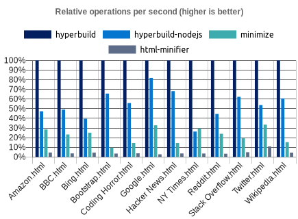
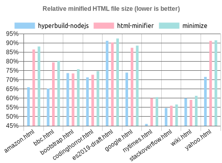

# hyperbuild

A fast one-pass in-place HTML minifier written in Rust with context-aware whitespace handling.

Available as:
- CLI for Windows, macOS, and Linux.
- Rust library.
- Native module for Node.js.

## Features

- Minification is done in one pass with no backtracking or DOM/AST building.
- No extra heap memory is allocated during processing, which increases performance.
- Context-aware whitespace handling allows maximum minification while retaining wanted spaces.

## Performance

Speed and effectiveness of Node.js version compared to other JS minifiers.

 

## Usage

### CLI

##### Get

[Windows](https://wilsonl.in/hyperbuild/bin/0.0.11-windows-x86_64.exe) |
[macOS](https://wilsonl.in/hyperbuild/bin/0.0.11-macos-x86_64) |
[Linux](https://wilsonl.in/hyperbuild/bin/0.0.11-linux-x86_64)

##### Use

```bash
hyperbuild --src /path/to/src.html --out /path/to/output.min.html
```

### API

<details>
<summary><strong>Rust</strong></summary>

##### Get

```toml
[dependencies]
hyperbuild = "0.0.11"
```

##### Use

```rust
use hyperbuild::hyperbuild;

fn main() {
    let mut code = b"<p>  Hello, world!  </p>"; 
    match hyperbuild(&mut code) {
        Ok(minified_len) => {}
        Err(error_type, error_at_char_no) => {}
    };
}
```

</details>

<details>
<summary><strong>Node.js</strong></summary>

hyperbuild is available as a [Node.js native module](https://www.npmjs.com/package/hyperbuild), and supports Node.js versions 8 and higher.

##### Get

Using npm:

```bash
npm i hyperbuild
```

Using Yarn:

```bash
yarn add hyperbuild
```

##### Use

```js
const hyperbuild = require("hyperbuild");

const minified = hyperbuild.minify("<p>  Hello, world!  </p>");
```

</details>

## Minification

### Whitespace

hyperbuild has advanced context-aware whitespace minification that does things such as:

- Leave whitespace untouched in `pre` and `code`, which are whitespace sensitive.
- Trim and collapse whitespace in content tags, as whitespace is collapsed anyway when rendered.
- Remove whitespace in layout tags, which allows the use of inline layouts while keeping formatted code.

#### Methods

There are three whitespace minification methods. When processing text content, hyperbuild chooses which ones to use depending on the containing element.

<details>
<summary><strong>Collapse whitespace</strong></summary>

> **Applies to:** any element except [whitespace sensitive](./src/spec/tag/wss.rs) elements.

Reduce a sequence of whitespace characters in text nodes to a single space (U+0020).

<table><thead><tr><th>Before<th>After<tbody><tr><td>

```html
<p>↵
··The·quick·brown·fox↵
··jumps·over·the·lazy↵
··dog.↵
</p>
```

<td>

```html
<p>·The·quick·brown·fox·jumps·over·the·lazy·dog.·</p>
```

</table>
</details>

<details>
<summary><strong>Destroy whole whitespace</strong></summary>

> **Applies to:** any element except [whitespace sensitive](./src/spec/tag/wss.rs), [content](./src/spec/tag/content.rs), [content-first](./src/spec/tag/contentfirst.rs), and [formatting](./src/spec/tag/formatting.rs) elements.

Remove any text nodes that only consist of whitespace characters.

<table><thead><tr><th>Before<th>After<tbody><tr><td>

```html
<ul>↵
··<li>A</li>↵
··<li>B</li>↵
··<li>C</li>↵
</ul>
```

<td>

```html
<ul>↵
··<li>A</li><li>B</li><li>C</li>↵
</ul>
```

</table>
</details>

<details>
<summary><strong>Trim whitespace</strong></summary>

> **Applies to:** any element except [whitespace sensitive](./src/spec/tag/wss.rs) and [formatting](./src/spec/tag/formatting.rs) elements.

Remove any leading/trailing whitespace from any leading/trailing text nodes of a tag.

<table><thead><tr><th>Before<th>After<tbody><tr><td>

```html
<p>↵
··Hey,·I·<em>just</em>·found↵
··out·about·this·<strong>cool</strong>·website!↵
··<sup>[1]</sup>↵
</p>
```

<td>

```html
<p>Hey,·I·<em>just</em>·found↵
··out·about·this·<strong>cool</strong>·website!↵
··<sup>[1]</sup></p>
```

</table>
</details>

#### Element types

hyperbuild recognises elements based on one of a few ways it assumes they are used. By making these assumptions, it can apply optimal whitespace minification strategies.

|Group|Elements|Expected children|
|---|---|---|
|Formatting|`a`, `strong`, [and others](./src/spec/tag/formatting.rs)|Formatting elements, text.|
|Content|`h1`, `p`, [and others](./src/spec/tag/content.rs)|Formatting elements, text.|
|Layout|`div`, `ul`, [and others](./src/spec/tag/layout.rs)|Layout elements, content elements.|
|Content-first|`label`, `li`, [and others](./src/spec/tag/contentfirst.rs)|Like content but could be layout with only one child.|

<details>
<summary><strong>Formatting elements</strong></summary>

> Whitespace is collapsed.

Formatting elements are usually inline elements that wrap around part of some text in a content element, so its whitespace isn't trimmed as they're probably part of the content.

</details>

<details>
<summary><strong>Content elements</strong></summary>

> Whitespace is trimmed and collapsed.

Content elements usually represent a contiguous and complete unit of content such as a paragraph. As such, whitespace is significant but sequences of them are most likely due to formatting.

###### Before

```html
<p>↵
··Hey,·I·<em>just</em>·found↵
··out·about·this·<strong>cool</strong>·website!↵
··<sup>[1]</sup>↵
</p>
```

###### After

```html
<p>Hey,·I·<em>just</em>·found·out·about·this·<strong>cool</strong>·website!·<sup>[1]</sup></p>
```

</details>

<details>
<summary><strong>Layout elements</strong></summary>

> Whitespace is trimmed and collapsed. Whole whitespace is removed.

These elements should only contain other elements and no text. This makes it possible to remove whole whitespace, which is useful when using `display: inline-block` so that whitespace between elements (e.g. indentation) does not alter layout and styling.

###### Before

```html
<ul>↵
··<li>A</li>↵
··<li>B</li>↵
··<li>C</li>↵
</ul>
```

###### After

```html
<ul><li>A</li><li>B</li><li>C</li></ul>
```

</details>

<details>
<summary><strong>Content-first elements</strong></summary>

> Whitespace is trimmed and collapsed.

These elements are usually like content elements but are occasionally used like a layout element with one child. Whole whitespace is not removed as it might contain content, but this is OK for using as layout as there is only one child and whitespace is trimmed.

###### Before

```html
<li>↵
··<article>↵
····<section></section>↵
····<section></section>↵
··</article>↵
</li>
```

###### After

```html
<li><article><section></section><section></section></article></li>
```

</details>

### Tags

[Optional closing tags](https://html.spec.whatwg.org/multipage/syntax.html#syntax-tag-omission) are removed.

### Attributes

Any entities in attribute values are decoded, and then the shortest representation of the value is calculated and used:

- Double quoted, with any `"` encoded.
- Single quoted, with any `'` encoded.
- Unquoted, with `"`/`'` first character (if applicable), `>` last character (if applicable), and any whitespace encoded.

Some attributes have their whitespace (after any decoding) trimmed and collapsed:

- `class`

`type` attributes on `script` tags with an empty value or value equaling a [JavaScript MIME type](https://mimesniff.spec.whatwg.org/#javascript-mime-type) are removed.  
`type` attributes on `style` tags are removed.  

If an attribute value is empty after any processing, it is completely removed (i.e. no `=`).

Spaces are removed between attributes if possible.

### Other

- Comments are removed.
- Entities are decoded if valid (see relevant parsing section).
- Whitespace is trimmed and collapsed inside `<script>` with JS code and `<style>`.

### Ignored

Bangs and empty elements are not removed as it is assumed there is a special reason for their declaration.

## Parsing

Only UTF-8/ASCII-encoded HTML code is supported.

hyperbuild simply does HTML minification, and almost does no syntax checking or standards enforcement for performance and code complexity reasons.

For example, this means that it's not an error to have self-closing tags, declare multiple `<body>` elements, use incorrect attribute names and values, or write something like `<br>alert('');</br>`

However, there are some syntax requirements for speed and sanity reasons.

### Tags

Tag names are case sensitive. For example, this means that `P` won't be recognised as a content element, `bR` won't be considered as a void tag, and the contents of `Script` won't be parsed as JavaScript.

Tags must not be [omitted](https://html.spec.whatwg.org/multipage/syntax.html#syntax-tag-omission). Void tags must not have a separate closing tag e.g. `</input>`.

### Entities

Well-formed entities are decoded, including in attribute values.

They are interpreted as characters representing their decoded value. This means that `&#9;` is considered a whitespace character and could be minified.

Malformed entities are interpreted literally as a sequence of characters.

If a named entity is an invalid reference as per the [specification](https://html.spec.whatwg.org/multipage/named-characters.html#named-character-references), it is considered malformed.

Numeric character references that do not reference a valid [Unicode Scalar Value](https://www.unicode.org/glossary/#unicode_scalar_value) are considered malformed.

No ampersand can immediately follow a malformed entity e.g. `&am&`, `&&`, or `&&#97;&#109;&#112;;`.

### Attributes

Backticks (`` ` ``) are not valid quote marks and not interpreted as such.
However, backticks are valid attribute value quotes in Internet Explorer.

It is an error if there is:

- whitespace between `=` and an attribute name/value;
- no whitespace before an attribute; and/or
- an unquoted attribute value.

For example:

```html
<div id = "a"unquoted=abc></div>
```

Special handling of some attributes require case sensitive names and values. For example, `CLASS` won't be recognised as an attribute to minify, and `type="Text/JavaScript"` on a `<script>` will cause the element to be parsed as a [data block](https://html.spec.whatwg.org/dev/scripting.html#data-block) instead of JavaScript code.

### Script and style

`script` and `style` tags must be closed with `</script>` and `</style>` respectively (case sensitive).

Note that the closing tag must not contain any whitespace (e.g. `</script  >`).

[hyperbuild can handle text script content.](./notes/Text%20script%20content.md)

## Development

### More minification options

- Removal of boolean attribute values.
- Removal of redundant attributes (empty or default value).
- Handling of conditional or special comments.
