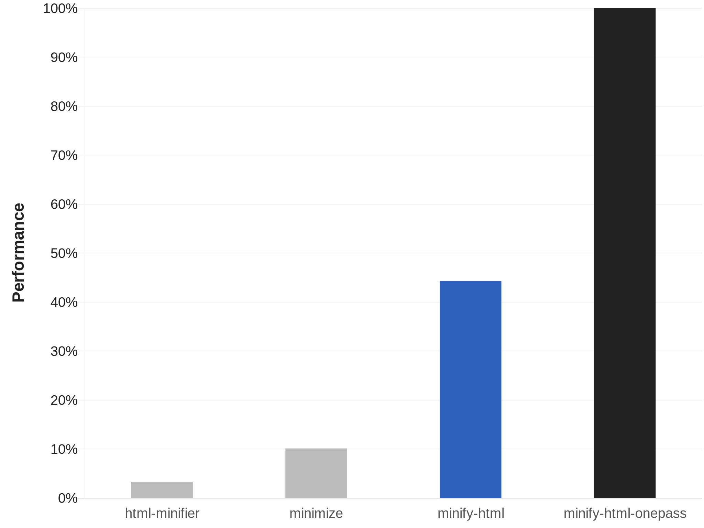
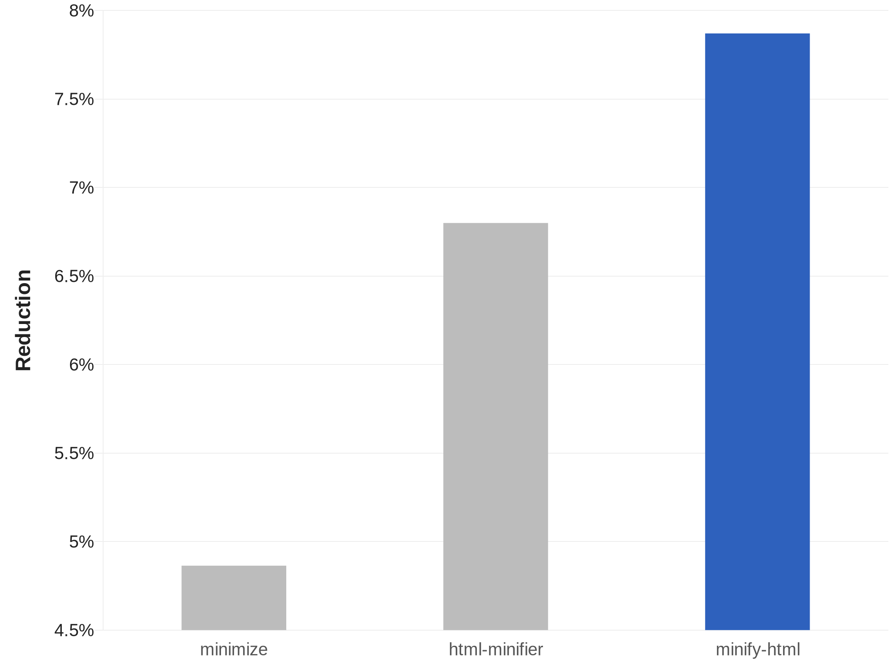

<h1>
minify-html


</h1>

A Rust HTML minifier meticulously optimised for speed and effectiveness, with bindings for other languages.

- Advanced minification strategy beats other minifiers in effectiveness while still being much faster.
- Handles [invalid HTML](./notes/Parsing.md) and [templating syntax](#templating-syntax).
- Uses [minify-js](https://github.com/wilsonzlin/minify-js) and [lightningcss](https://github.com/parcel-bundler/lightningcss) for super fast JS and CSS minification.

View the [changelog](./CHANGELOG.md) to see the latest updates.

## Performance

Comparison with [html-minifier](https://github.com/kangax/html-minifier) and [minimize](https://github.com/Swaagie/minimize), run on the top web pages. [See the breakdown here.](./bench)



The [onepass](https://github.com/wilsonzlin/minify-html/tree/master/minify-html-onepass) variant is even more optimised for speed. See its [README](https://github.com/wilsonzlin/minify-html/tree/master/minify-html-onepass) for more details.

## Compatibility and usage

<details>
<summary> <strong>CLI</strong></summary>

The CLI is called [minhtml](./minhtml).
Precompiled binaries are available for Linux (ARM64 and x64), macOS (ARM64 and x64), and Windows (x64).
You can download them in the GitHub release.

If you have Cargo installed, you can also build and install from source: `cargo install minhtml`.

### Use

Use the `--help` argument for more details.

```bash
minhtml --output /path/to/output.min.html --keep-closing-tags --minify-css /path/to/src.html
```

To quickly parallel process a batch of files in place:

```bash
minhtml --keep-closing-tags --minify-css /path/to/**/*.html
```

</details>

<details>
<summary> <strong>Rust</strong></summary>

### Get

```toml
[dependencies]
minify-html = "0.16.4"
```

### Use

Check out the [docs](https://docs.rs/minify-html) for API and usage examples.

</details>

<details>
<summary> <strong>Deno</strong></summary>

- Package: [@minify-html/deno](https://jsr.io/@minify-html/deno/)
- Binding: [WASM](https://webassembly.org/)
- Platforms: All

### Get

Add the JSR package:

```
deno add jsr:@minify-html/deno
```

### Use

```ts
import init, {minify} from "@minify-html/deno";

const encoder = new TextEncoder();
const decoder = new TextDecoder();

await init();

const minified = decoder.decode(minify(encoder.encode("<p>  Hello, world!  </p>"), { keep_spaces_between_attributes: true, keep_comments: true }));
```

All [`Cfg` fields](https://docs.rs/minify-html/latest/minify_html/struct.Cfg.html) are available as snake_case properties on the object provided as the second argument; if any are not set, they default to `false`.

</details>

<details>
<summary> <strong>Node.js</strong></summary>

- Package: [@minify-html/node](https://www.npmjs.com/package/@minify-html/node)
- Binding: [Neon](https://github.com/neon-bindings/neon)
- Platforms: Linux (ARM64 and x64), macOS (ARM64 and x64), Windows (x64); Node.js 8.6.0 and higher

### Get

Using npm:

```bash
npm i @minify-html/node
```

Using Yarn:

```bash
yarn add @minify-html/node
```

### Use

TypeScript definitions are available.

```ts
import { Buffer } from "node:buffer";
import minifyHtml from "@minify-html/node";
// Or `const minifyHtml = require("@minify-html/node")` if not using TS/ESM.

const minified = minifyHtml.minify(Buffer.from("<p>  Hello, world!  </p>"), { keep_spaces_between_attributes: true, keep_comments: true });
```

All [`Cfg` fields](https://docs.rs/minify-html/latest/minify_html/struct.Cfg.html) are available as snake_case properties on the object provided as the second argument; if any are not set, they default to `false`.

</details>

<details>
<summary> <strong>Java</strong></summary>

- Package: [in.wilsonl.minifyhtml](https://search.maven.org/artifact/in.wilsonl.minifyhtml/minify-html)
- Binding: [JNI](https://github.com/jni-rs/jni-rs)
- Platforms: Linux (ARM64 and x64), macOS (ARM64 and x64), Windows (x64); Java 7 and higher

### Get

Add as a Maven dependency:

```xml
<dependency>
  <groupId>in.wilsonl.minifyhtml</groupId>
  <artifactId>minify-html</artifactId>
  <version>0.16.4</version>
</dependency>
```

### Use

```java
import in.wilsonl.minifyhtml.Configuration;
import in.wilsonl.minifyhtml.MinifyHtml;

Configuration cfg = new Configuration.Builder()
    .setKeepHtmlAndHeadOpeningTags(true)
    .setMinifyCss(true)
    .build();

String minified = MinifyHtml.minify("<p>  Hello, world!  </p>", cfg);
```

All [`Cfg` fields](https://docs.rs/minify-html/latest/minify_html/struct.Cfg.html) are available as camelCase setter methods on the `Builder`; if any are not set, they default to `false`.

</details>

<details>
<summary> <strong>Python</strong></summary>

- Package: [minify-html](https://pypi.org/project/minify-html)
- Binding: [PyO3](https://github.com/PyO3/pyo3)
- Platforms: Linux (ARM64 and x64), macOS (ARM64 and x64), Windows (x64); Python 3.8 to 3.13

### Get

Add the PyPI project as a dependency and install it using `pip` or `pipenv`.

### Use

```python
import minify_html

minified = minify_html.minify("<p>  Hello, world!  </p>", minify_js=True, remove_processing_instructions=True)
```

All [`Cfg` fields](https://docs.rs/minify-html/latest/minify_html/struct.Cfg.html) are available as Python keyword arguments; if any are omitted, they default to `False`.

</details>

<details>
<summary> <strong>Ruby</strong></summary>

- Package: [minify_html](https://rubygems.org/gems/minify_html)
- Binding: [rb-sys](https://github.com/oxidize-rb/rb-sys) and [magnus](https://github.com/matsadler/magnus)
- Platforms: Linux (ARM64 and x64), macOS (ARM64 and x64), Windows (x64); Ruby 2.7 to 3.4

### Get

Add the library as a dependency to `Gemfile` or `*.gemspec`.

### Use

```ruby
require 'minify_html'

print minify_html("<p>  Hello, world!  </p>", { :keep_spaces_between_attributes => true, :minify_js => true })
```

All [`Cfg` fields](https://docs.rs/minify-html/latest/minify_html/struct.Cfg.html) are available; if any are omitted, they default to `false`.

</details>

<details>
<summary> <strong>WASM</strong></summary>

- Package: [@minify-html/wasm](https://npmjs.org/package/@minify-html/wasm)
- Binding: [WASM](https://webassembly.org/)
- Platforms: All

A bundler may be required to use the WebAssembly module, see [this](https://rustwasm.github.io/wasm-bindgen/reference/deployment.html#bundlers) for more details.

### Use

```ts
import init, {minify} from "@minify-html/wasm";

const encoder = new TextEncoder();
const decoder = new TextDecoder();

await init();

const minified = decoder.decode(minify(encoder.encode("<p>  Hello, world!  </p>"), { keep_spaces_between_attributes: true, keep_comments: true }));
```

All [`Cfg` fields](https://docs.rs/minify-html/latest/minify_html/struct.Cfg.html) are available as snake_case properties on the object provided as the second argument; if any are not set, they default to `false`.

</details>

## Templating syntax

minify-html can parse and preserve `{{`/`{%`/`{#` and `<%` syntax in the source code, which allows minification of many HTML templates written for most engines like Pebble, Mustache, Django, Go, Jinja, Twix, Nunjucks, Handlebars, Sailfish, JSP, EJS, and ERB. Look for the `preserve_*_template_syntax` Cfg options.

PHP blocks (`<?php` or `<?=`) also happen to be processing instructions, which are preserved by default.

Note that in all of these syntax, the parsing is "dumb": it will simply look for the next subsequence of characters that match the closing delimiter. This may cause issues if nesting or string literals appear inside these blocks, but this should be rare.

## Minification

### Spec compliance

WHATWG is the current HTML standard and [obsoletes all previous standards](https://www.w3.org/html/). WHATWG lists suggested validators [here](https://whatwg.org/validator/).

To minify even further, it's possible to enable options that may output HTML that doesn't fully pass validation, but is still interpreted and rendered correctly according to the [WHATWG parsing specification](https://html.spec.whatwg.org/multipage/parsing.html), which major browser engines (Firefox, Chrome, Safari) implement. Refer to these options:

- `allow_noncompliant_unquoted_attribute_values`
- `allow_optimal_entities`
- `allow_removing_spaces_between_attributes`
- `minify_doctype`

In Rust, `Cfg::enable_possibly_noncompliant` can enable all of these at once.

### Whitespace

minify-html has advanced context-aware whitespace minification that does things such as:

- Leave whitespace untouched in `pre` and `code`, which are whitespace sensitive.
- Trim and collapse whitespace in content tags, as whitespace is collapsed anyway when rendered.
- Remove whitespace in layout tags, which allows the use of inline layouts while keeping formatted code.

#### Methods

There are three whitespace minification methods. When processing text content, minify-html chooses which ones to use depending on the containing element.

<details>
<summary><strong>Collapse whitespace</strong></summary>

> **Applies to:** any element except [whitespace sensitive](./minify-html-common/src/spec/tag/whitespace.rs) elements.

Reduce a sequence of whitespace characters in text nodes to a single space (U+0020).

<table><thead><tr><th>Before<th>After<tbody><tr><td>

```html
<p>↵
··The·quick·brown·fox↵
··jumps·over·the·lazy↵
··dog.↵
</p>
```

<td>

```html
<p>·The·quick·brown·fox·jumps·over·the·lazy·dog.·</p>
```

</table>
</details>

<details>
<summary><strong>Destroy whole whitespace</strong></summary>

> **Applies to:** any element except [whitespace sensitive](./minify-html-common/src/spec/tag/whitespace.rs), [content](src/spec/tag/whitespace.rs), [content-first](./minify-html-common/src/spec/tag/whitespace.rs), and [formatting](./minify-html-common/src/spec/tag/whitespace.rs) elements.

Remove any text nodes between tags that only consist of whitespace characters.

<table><thead><tr><th>Before<th>After<tbody><tr><td>

```html
<ul>↵
··<li>A</li>↵
··<li>B</li>↵
··<li>C</li>↵
</ul>
```

<td>

```html
<ul>↵
··<li>A</li><li>B</li><li>C</li>↵
</ul>
```

</table>
</details>

<details>
<summary><strong>Trim whitespace</strong></summary>

> **Applies to:** any element except [whitespace sensitive](./minify-html-common/src/spec/tag/whitespace.rs) and [formatting](./minify-html-common/src/spec/tag/whitespace.rs) elements.

Remove any leading/trailing whitespace from any leading/trailing text nodes of a tag.

<table><thead><tr><th>Before<th>After<tbody><tr><td>

```html
<p>↵
··Hey,·I·<em>just</em>·found↵
··out·about·this·<strong>cool</strong>·website!↵
··<sup>[1]</sup>↵
</p>
```

<td>

```html
<p>Hey,·I·<em>just</em>·found↵
··out·about·this·<strong>cool</strong>·website!↵
··<sup>[1]</sup></p>
```

</table>
</details>

#### Element types

minify-html assumes HTML and SVG elements are used in specific ways, based on standards and best practices. By making these assumptions, it can apply optimal whitespace minification strategies. If these assumptions do not hold, consider adjusting the HTML source or turning off whitespace minification.

|Group|Elements|Expected children|
|---|---|---|
|Formatting|`a`, `strong`, [and others](./minify-html-common/src/spec/tag/whitespace.rs)|Formatting elements, text.|
|Content|`h1`, `p`, [and others](./minify-html-common/src/spec/tag/whitespace.rs)|Formatting elements, text.|
|Layout|`div`, `ul`, [and others](./minify-html-common/src/spec/tag/whitespace.rs)|Layout elements, content elements.|
|Content-first|`label`, `li`, [and others](./minify-html-common/src/spec/tag/whitespace.rs)|Like content but could be layout with only one child.|

<details>
<summary><strong>Formatting elements</strong></summary>

> Whitespace is collapsed.

Formatting elements are usually inline elements that wrap around part of some text in a content element, so its whitespace isn't trimmed as they're probably part of the content.

</details>

<details>
<summary><strong>Content elements</strong></summary>

> Whitespace is trimmed and collapsed.

Content elements usually represent a contiguous and complete unit of content such as a paragraph. As such, whitespace is significant but sequences of them are most likely due to formatting.

###### Before

```html
<p>↵
··Hey,·I·<em>just</em>·found↵
··out·about·this·<strong>cool</strong>·website!↵
··<sup>[1]</sup>↵
</p>
```

###### After

```html
<p>Hey,·I·<em>just</em>·found·out·about·this·<strong>cool</strong>·website!·<sup>[1]</sup></p>
```

</details>

<details>
<summary><strong>Layout elements</strong></summary>

> Whitespace is trimmed and collapsed. Whole whitespace is removed.

These elements should only contain other elements and no text. This makes it possible to remove whole whitespace, which is useful when using `display: inline-block` so that whitespace between elements (e.g. indentation) does not alter layout and styling.

###### Before

```html
<ul>↵
··<li>A</li>↵
··<li>B</li>↵
··<li>C</li>↵
</ul>
```

###### After

```html
<ul><li>A</li><li>B</li><li>C</li></ul>
```

</details>

<details>
<summary><strong>Content-first elements</strong></summary>

> Whitespace is trimmed and collapsed.

These elements are usually like content elements but are occasionally used like a layout element with one child. Whole whitespace is not removed as it might contain content, but this is OK for using as layout as there is only one child and whitespace is trimmed.

###### Before

```html
<li>↵
··<article>↵
····<section></section>↵
····<section></section>↵
··</article>↵
</li>
```

###### After

```html
<li><article><section></section><section></section></article></li>
```

</details>

### Tags

[Optional opening and closing tags](https://html.spec.whatwg.org/multipage/syntax.html#syntax-tag-omission) are removed.

### Attributes

Any entities in attribute values are decoded, and then the shortest representation of the value is calculated and used:

- Double quoted, with any `"` encoded.
- Single quoted, with any `'` encoded.
- Unquoted, with `"`/`'` first character (if applicable), any `>`, and any whitespace encoded.

Attributes have their whitespace (after any decoding) trimmed and collapsed when possible.

[Boolean attribute](https://github.com/wilsonzlin/html-data) values are removed.
[Some other attributes](https://github.com/wilsonzlin/html-data) are completely removed if their value is empty or the default value after any processing.

`type` attributes on `script` tags with a value equaling a [JavaScript MIME type](https://mimesniff.spec.whatwg.org/#javascript-mime-type) are removed.

If an attribute value is empty after any processing, everything but the name is completely removed (i.e. no `=`), as an empty attribute is implicitly [the same](https://html.spec.whatwg.org/multipage/syntax.html#attributes-2) as an attribute with an empty string value.

Spaces are removed between attributes when possible.

### Entities

Entities are decoded if they're valid and shorter or equal in length when decoded. UTF-8 sequences that have a shorter entity representation are encoded.

Numeric entities that do not refer to a valid [Unicode Scalar Value](https://www.unicode.org/glossary/#unicode_scalar_value) are replaced with the [replacement character](https://en.wikipedia.org/wiki/Specials_(Unicode_block)#Replacement_character).

Encoding is avoided when possible; for example, `<` are only encoded in content if they are followed by a valid tag name character.
If necessary, the shortest entity representation is chosen.

### Comments

Comments are removed.

### Ignored

Bangs, [processing instructions](https://en.wikipedia.org/wiki/Processing_Instruction), and empty elements are not removed as it is assumed there is a special reason for their declaration.

## Parsing

minify-html can process any HTML, handling all possible syntax (including invalid ones) gracefully like browsers. See [Parsing.md](./notes/Parsing.md) for more details.

## Issues and contributions

Pull requests and any contributions welcome!

If minify-html did something unexpected, misunderstood some syntax, or incorrectly kept/removed some code, [raise an issue](https://github.com/wilsonzlin/minify-html/issues) with some relevant code that can be used to reproduce and investigate the issue.
